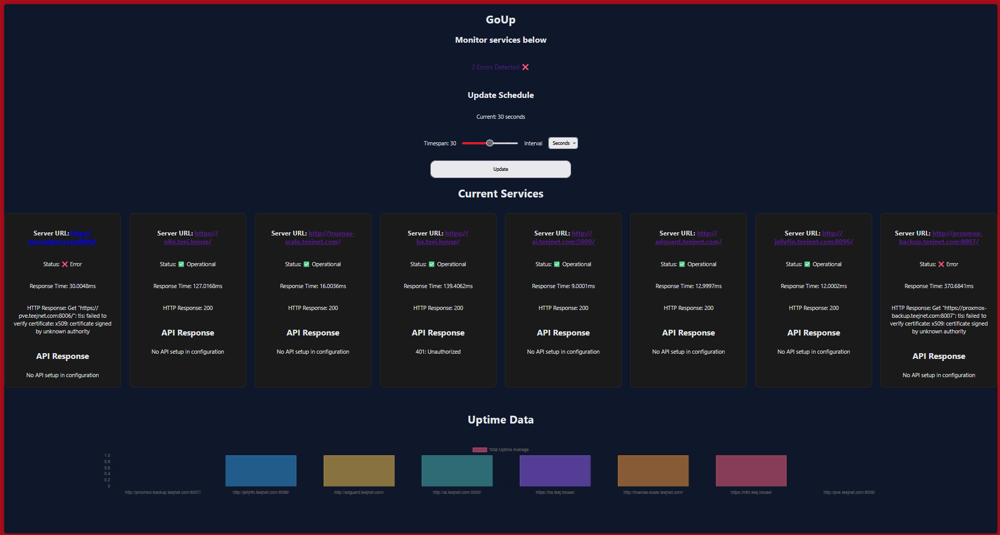

# GoUp

***Under-Development!***

**[Todo](TODO.md)**

Server monitor with HTTP web display and API routes for uptime, response time, status, and more! 



## Example services.yml

Services provide the name and url of the service to monitor currently just makes a basic HTTP request and make sure it responds with 200 or other configured valid responses.
  - Future updates will include a configurable server response as well as retry mechanisms

Triggers will provide information and credentials for managing triggers fired when a scrape happens to tell the user or other servers about a failed server(s). 

Current configurable triggers are listed below . . . 

### Example

```yaml
services:
  home_assistant:
    url: "https://ex.com/"
    api_url: "http://ex.com/api/"
    api_key: "<key>"

  truenas_scale:
    url: "http://ex-scale.com/"

triggers:
  mqtt:
    mqtt_broker: "<url>"
    mqtt_user: "<user>"
    mqtt_key: "<key>"
  webhook:
    webhook_url: "https://ex.com/"
    webhook_key: "<key>"

```

## Storage

Uses SQLite with Go [database/sql](https://pkg.go.dev/database/sql) package and [modernc.org/sqlite](https://pkg.go.dev/modernc.org/sqlite) driver as a dependency

Schema: 

```sql
"id" INTEGER PRIMARY KEY AUTOINCREMENT,
"service_name" TEXT,
"service_HTTP_response" TEXT,
"service_API_response" TEXT,
"service_response_time" TEXT
```

## Triggers

### MQTT Trigger

Client ID: goUp MQTT
State Topic: goup_status

Username and password credentials will only be used if they are provided in services.yml otherwise it will attempt a basic un-authorized tcp connection.

Will publish to the broker specified under the "goup_status" topic

Currently only MQTT is setup for my Home Assistant instance but if viable would wish to add more such as Email, Telegram, etc. but that is more on the integration than logic side.

### Webhook Trigger

Will send bad service data as JSON to the specified webhook URL

The key provided will be injected as a `Authorization` header. Meaning it accepts Basic, Bearer, etc. as a string value in the YAML.